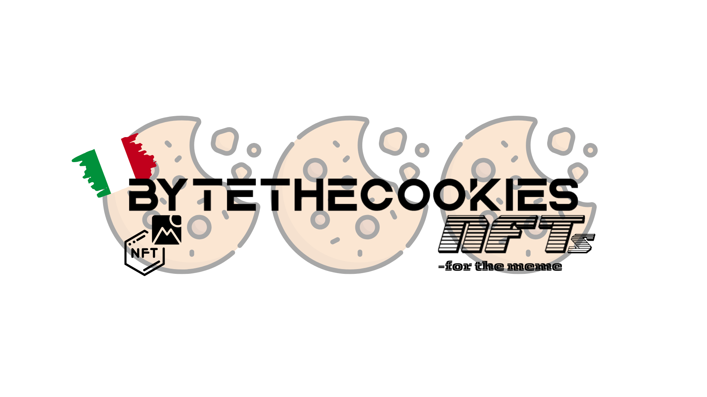

# ByteTheCookies NFTs

<picture>
  <source srcset="./assets/readmeImages/copertina.png" media="(min-width: 680px)">
    
  
        
    

</picture>

# Table of contens

- [ByteTheCookies NFTs](#bytethecookies-nfts)
- [Table of contens](#table-of-contens)
  - [Project Details](#project-details)
    - [Project Overview](#project-overview)
    - [Appendix](#appendix)

## Project Details

This project is an NFT project for the CTF group I am a part of. The goal is to create and trade non-fungible tokens (NFTs) within the group. Made for the meme ◕⩊◕

### Project Overview

The project aims to create a platform for the ByteTheCookies CTF group to create non-fungible tokens (NFTs). NFTs are unique digital assets that can represent ownership of digital or physical items. With this project, members of the group will be able to mint their own NFTs, showcase them, and (why not) trade them with other members.

The platform will provide features such as:

- NFT minting: Members can create their own NFTs by uploading digital assets and defining their properties.
- NFT showcase: A gallery on [ByteTheCookies](bytethecookies.github.io/) to showcase the NFTs created by the members.

The project will be developed on the **Ethereum** blockchain for the NFT tokenization. Each NFT will be saved completely on-chain so as not to depend on external servers. Basically there is irrefutable proof that every team member has true and absolute ownership of their asset in a cryptographically secure manner.

### Appendix

Please note, this project it was developed purely to practice with the development of smart contracts and to display profile images on the **ByteTheCookies** site in a more innovative way. 🚀

For further details regarding the project or the CTF team I am part of, do not hesitate to contact me. 😊
